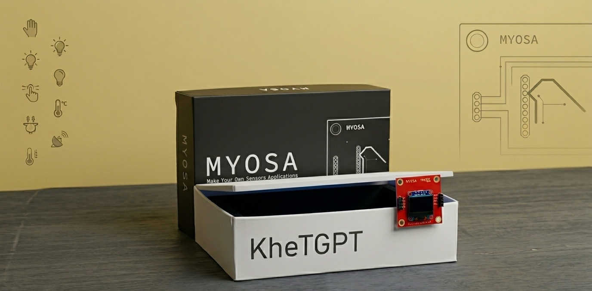
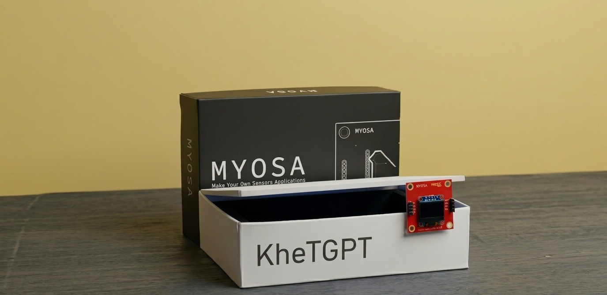

<p align="center">
  <br/>
  <i>KhetGPT</i>
</p>


> Every day, your field speaks — KhetGPT listens and tells you exactly what to do.
 
---
## Acknowledgements
 
Built by **TKMCE Students** as part of the MYOSA Make Your Own Sensors Applications initiative under the IEEE Sensors Council. Special thanks to the MYOSA team for the sensor platform and to the farming communities of Kollam, whose real problems shaped this project. 

---

## Overview
 
Smallholder farmers make daily decisions — when to irrigate, when to spray, when to harvest with no real-time, hyper-local data. National weather forecasts work at the district scale, not the field scale. Extension bulletins arrive weekly, not daily. There is no personalised, affordable advisory system built for the individual farm.
 
**KhetGPT** solves this by turning the MYOSA Mini into an always-on field intelligence node.  It reads temperature, barometric pressure, ambient light, and canopy colour from the BMP180, MPU6050 and APDS9960 sensors. That data is posted securely to a cloud server, which enriches it with a live weather forecast and hands the combined context to Google Gemini. The LLM generates a plain-language farm advisory — under 500 words — and delivers it to the farmer's messenger service (SMS,WhatsApp,Telegram) automatically. PS: For the current technical stack for messaging Telegram is used


No dashboard to check. No app to install. No technical knowledge needed. Just a message every morning in the farmer's own language telling them what happened in their field overnight and what to do today.

**Key features:**
 
* All MYOSA Mini sensors are active and contributing to the advisory
* Gemini LLM generates crop-aware, field-specific advice — not generic tips
* Delivery via Telegram bot — works on any smartphone, no extra app
* Secure ESP-to-server communication with API key authentication and rate limiting
* Fully automated — farmer receives the advisory without touching any device
* Language-configurable — Supports All languages as per the farmers need
---
 ## Demo / Examples
### **Image**
 <p align="center">
  <br/>
  <i>Prototype</i>
</p>

 ### **Videos**
https://github.com/user-attachments/assets/2da829e8-957e-4b59-a0f8-4527ce0ec689
<p align="center"><i>Demo</i></p>
 <video controls width="100%">
  <source src="myosa-presentation.mp4" type="video/mp4">
</video>
<p align="center"><i>Presentation</i></p>
<!-- align the file once uploaded -->
## Features (Detailed)
The MYOSA Mini's BMP180 and APDS9960 are both actively read every loop cycle:
 
| Sensor | Parameter | Agricultural meaning |
|--------|-----------|----------------------|
| BMP180 | Temperature (°C) | Canopy-level air temp; frost and heat stress detection |
| BMP180 | Barometric pressure (hPa) | Pressure drop = incoming cold front or storm |
| APDS9960 | Ambient light — clear channel (lux) | Photoperiod tracking; day-length affects flowering |
|MPU6050| Animal Intrusion | Equipped in Farming Fences |
 
All four values are packed into a structured plain-English string and posted to the server every 12 hours
### **2. Secure ESP-to-server communication**
 
The ESP32 posts sensor data to the Render-hosted Node.js server over HTTPS with two layers of protection:
 
* **API key header** (`X-ESP-Key`) — every request must carry the correct pre-shared key, verified using `crypto.timingSafeEqual` to prevent timing attacks
* **Per-IP rate limiting** — maximum 20 requests per 2-minute window per IP; excess requests receive HTTP 429

*The server rejects all unauthorised requests before they reach the LLM, keeping API costs predictable.
 ### **3. Gemini LLM advisory generation**
 
The sensor string is passed directly to `gemma-4-26b-a4b-it` via the `@google/genai` SDK. The prompt instructs Gemini to act as a farm advisor and generate a report in the farmer's configured language, under 500 words. The model reasons across all sensor values simultaneously and makes decisions based on **soil type, crop type and sensor data**

The LLM response is processed through a Markdown-to-Telegram-HTML converter before delivery:
 
* `**bold**` → `<b>bold</b>`
* `###` headings → bold text
* `*` bullets → `•` bullet points
* `---` dividers → `──────────────`
The formatted advisory is sent to the configured Telegram chat via the Bot API. Messages exceeding Telegram's 4,096-character limit are automatically truncated.

For Project purposes, the Messaging Part is implemented in Telegram for real case scenarios. The same system can be incorporated into SMS or WhatsApp-based messaging systems

### **4. OLED real-time display**
 
While the advisory is generated and delivered in the cloud, the OLED shows live sensor readings locally at the field node at all times — useful for in-field inspection without a phone.
 
Display layout:
```
KhetGPT
────────────────
Temp: 24.3 C
Press: 1012.4 hPa
Light: 1847
────────────────
```

### **5. Language configuration**
 
The advisory language is set in a single firmware constant:
 
```cpp
const char* Lang = "English";  // Change to "Malayalam", "Tamil", "Hindi", etc.
```
 
Gemini honours the language instruction and generates the full advisory in that language — no translation API needed.
 
---

## Usage Instructions
 
### Setting up the cloud server
 
**1. Clone the server and install dependencies:**
 
```bash
git clone https://github.com/NAVAJYOTH-KRISHNAN/myosa-khetgpt/tree/main/server
cd myosa-khetgpt/tree/main/server
npm install
```
 
**2. Set environment variables** (on Render, Railway, or locally via `.env`):
 
```plaintext
GEMINI_API_KEY=your_google_gemini_api_key
TELEGRAM_BOT_TOKEN=your_telegram_bot_token
TELEGRAM_CHAT_ID=your_telegram_chat_id
ESP_API_KEY=your_random_secret_key_minimum_32_chars
PORT=3000
```
 
**3. Start the server:**
 
```bash
npm start
```
 
The server will be live at `http://localhost:3000` or your Render deployment URL.
 
---

### Setting up the ESP32 firmware
 
**1. Install required Arduino libraries** via Library Manager:
 
```plaintext
Adafruit BMP085 Library
Adafruit APDS9960 Library
Adafruit SSD1306
Adafruit MPU6050
Adafruit GFX Library
```
 
**2. Edit the firmware constants** in `khetgpt_esp32.ino`:
 
```cpp
const char* WIFI_SSID     = "YOUR_WIFI_NAME";
const char* WIFI_PASSWORD = "YOUR_WIFI_PASSWORD";
 
const char* SERVER_URL    = "https://your-server.onrender.com/process";
const char* ESP_API_KEY   = "your_secret_key_matching_server_env";
 
const char* Lang = "English";   // Advisory language
```
 
**3. Flash to ESP32** via Arduino IDE (board: ESP32 Dev Module, upload speed: 115200).
 
**4. Open Serial Monitor** at 115200 baud to confirm sensor readings and server responses.
 
---
 
### Getting your Telegram bot and chat ID
 
```plaintext
1. Message @BotFather on Telegram → /newbot → follow prompts → copy the token
2. Add the bot to your chat or group
3. Message @userinfobot to get your chat ID
4. Set both values as environment variables on the server
```
 
---

### Wiring (MYOSA Mini — no soldering needed)
 
All sensors connect via the MYOSA Mini's plug-and-play I2C connector:
 
```plaintext
BMP180   → I2C port (SDA/SCL)
APDS9960 → I2C port (SDA/SCL)
MPU6050  → I2C port (SDA/SCL)
OLED     → I2C port (SDA/SCL, address 0x3C)
```
 
---
 
## Tech Stack
 
* **ESP32** — MYOSA Mini motherboard; Wi-Fi + I2C sensor polling
* **BMP180** — Barometric pressure and temperature sensor
* **APDS9960** — Ambient light and RGB colour sensor
* **SSD1306 OLED** — 128×64 local display
* **Arduino C++** — ESP32 firmware (Arduino framework)
* **MPU6050** — For checking animal intrusion
* **18650 Battery Circuit** — For Powering the Device
* **Node.js + Express** — Lightweight cloud API server
* **Google Gemini (`gemma-4-26b-a4b-it`)** — LLM advisory generation via `@google/genai` SDK
* **Telegram Bot API** — Advisory delivery to farmer's phone
* **Render** — Free-tier cloud hosting for the Node.js server
* **HTTPS + API key + rate limiting** — Security layer between ESP and server
---
 
## Requirements / Installation
 
### Server dependencies
 
```bash
npm install
```
 
`package.json` dependencies:
 
```json
{
  "dependencies": {
    "@google/genai": "^0.7.0",
    "express": "^4.18.2"
  }
}
```
 
### Arduino library dependencies
 
```plaintext
Adafruit BMP085 Library       (v1.x)
Adafruit APDS9960 Library     (v1.x)
Adafruit SSD1306              (v2.x)
Adafruit GFX Library          (v1.x)
Adafruit MPU6050              (v1.x)
WiFi / HTTPClient / WiFiClientSecure  (bundled with ESP32 Arduino core)
```
 
### ESP32 Arduino core
 
Install via Arduino IDE → Boards Manager → search "esp32" → install **Espressif Systems esp32**.
 
### Environment variables required on server
 
```plaintext
GEMINI_API_KEY        — Google AI Studio API key
TELEGRAM_BOT_TOKEN    — From @BotFather
TELEGRAM_CHAT_ID      — Target chat or group ID
ESP_API_KEY           — Shared secret (min 32 chars, random)
PORT                  — (optional; Render sets this automatically)
```
 
---
## File Structure
```plaintext
/myosa-khetgpt
  ├─ README.md
  ├─ khetgpt.ino
  ├─ khetgpt_cover_img.png
  ├─ myosa-demo.mp4
  ├─ myosa-img.png
  ├─ myosa-presentation.mp4
  └─ server/
      ├─ package.json
      └─ server.js
```

## License
 
MIT License — open for educational use, modification, and deployment by farming communities and research institutions.

## Contribution Notes
 
Contributions welcome. Priority areas for improvement:
 
* **Solar Charging** - Adding of Solar based charging
* **Soil moisture sensor** — add a capacitive soil probe for irrigation scheduling precision
* **LoRa fallback** — replace Wi-Fi with LoRa for farms without mobile coverage
* **Voice advisory** — pipe Gemini output through a TTS API (ElevenLabs or Google TTS) for audio delivery for farmers lagging technical skills 
* **Prompt tuning** — improve the sensor-to-prompt template for specific crops (cardamom, pepper, banana, tomato, rice)
Open an issue or submit a PR on the project repository.

<!-- 

Add cover Page 
Add Images 
Add Presentation and demo video
Add Codebase changes
Add mpu specs
ProofRead

